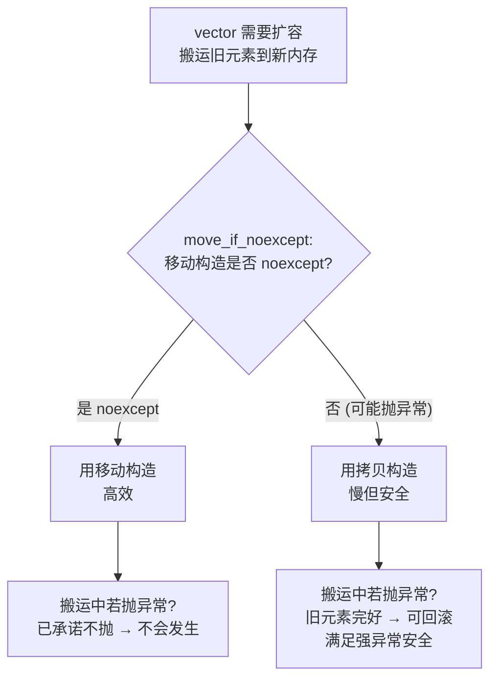
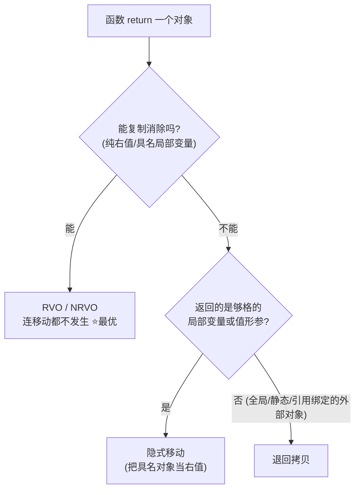
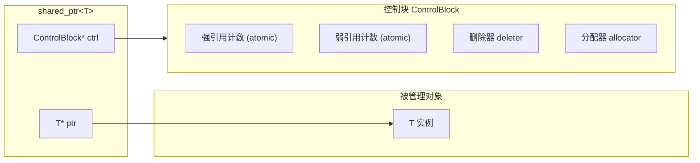
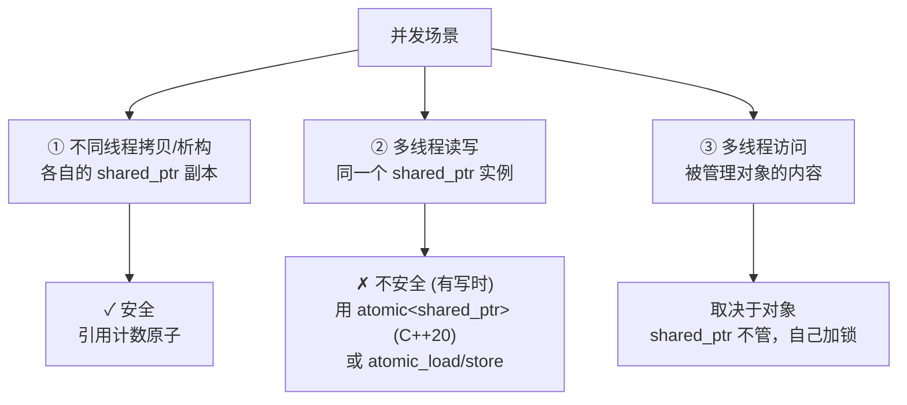

# C++ 移动语义与智能指针 · 面试复习

> 四道高频深挖题：noexcept 移动、RVO/NRVO、移动后源对象状态、shared_ptr 线程安全边界。
> 每题结构：核心结论 → 机制 → 易错点 → 一句话总结。

---

## 一、noexcept 移动与 vector 扩容

### 核心结论

- 移动构造**标了 `noexcept`** → `vector` 扩容时调用**移动构造**。
- **没标** → 退回调用**拷贝构造**。
- 底层由 `std::move_if_noexcept` 决定走哪条。

### 机制：为什么退回拷贝（设计动机）

为了保证**强异常安全**。扩容时元素从旧内存搬到新内存，如果搬到一半移动构造抛异常，已被移走的元素旧位置已被掏空，**无法回滚**到扩容前状态。而拷贝失败时旧元素原封不动，可以直接释放新内存、保留旧内存回滚。所以容器宁可牺牲性能用拷贝，除非移动保证不抛（noexcept）才敢用移动。



### 关于 noexcept 的契约

- `noexcept` 是对编译器的**承诺**。一旦标了却真的抛出异常 → 直接 `std::terminate`，进程终止（不是抛给上层 catch）。
- 移动构造通常只是转移指针/句柄，本就不抛异常，所以标 `noexcept` 既符合实际也符合性能需要。
- 不能乱标：内部可能分配内存等会抛异常的操作，就不该硬标。

### 易错点

- `move_if_noexcept` 的完整条件是「移动构造 noexcept **或** 没有可用的拷贝构造」。一个只能移动（拷贝被删）的类型，即使移动没标 noexcept，扩容也会用移动——因为没得选。
- 同样逻辑适用于移动赋值和 `swap`。

### 一句话总结

> 标 noexcept 是为了让容器扩容时能用移动而非拷贝；本质是容器在性能与强异常安全之间权衡——只有保证不抛，它才敢选更快的移动。

---

## 二、RVO / NRVO 与移动语义的触发边界

### 核心结论

RVO/NRVO 是编译器的**返回值优化（复制消除）**：函数返回对象时，**直接在调用方的目标位置构造对象**，消除本应发生的拷贝/移动。

| 名称 | 返回的东西 | C++17 起 |
|------|-----------|----------|
| **RVO** | 匿名临时对象（纯右值） | **强制**（mandatory） |
| **NRVO** | 具名局部变量 | **始终可选**（编译器可做可不做） |

```cpp
// RVO：返回纯右值，C++17 强制，连拷贝/移动被 delete 也能编译
Widget make() { return Widget(1, 2); }

// NRVO：返回具名局部变量，标准只允许、从不强制
Widget make() {
    Widget w(1, 2);
    return w;
}
```

### 触发边界：优先级链

**复制消除（RVO/NRVO）> 隐式移动 > 拷贝**。编译器从顶端往下落，能用上面就不用下面。



- **第一档·复制消除**：连移动都省了，移动语义根本没触发。
- **第二档·隐式移动**：复制消除用不上、但返回的是够格的局部变量或按值形参时，编译器把它当右值，触发移动。C++20 起把函数形参、右值引用形参也纳入候选。
- **第三档·拷贝**：返回全局/静态对象、引用绑定的外部对象时只能拷贝。

### 关键区别：return 的隐式移动「不看」noexcept

- **return 隐式移动**：不看 noexcept。单个对象构造，要么成要么不成，不涉及批量回滚。
- **vector 扩容**：看 noexcept。批量搬运，需保证强异常安全。

> 能讲清「为什么 return 不看 noexcept 而 vector 看」是加分项。

### 易错点：别画蛇添足 `return std::move(局部变量)`

```cpp
Widget make() {
    Widget w;
    return std::move(w);   // ✗ 禁用了 NRVO，反而可能更慢
}
```

`std::move` 把返回值变成右值引用，**不满足 NRVO 条件**（NRVO 要求返回的就是那个对象本身），直接扼杀了更优的复制消除。即使做不了 NRVO，`return w;` 时标准也会把 w 当右值隐式移动。**所以永远写 `return w;`，把档位选择权交给编译器。**

### 一句话总结

> RVO/NRVO 在函数返回时直接在目标位置构造对象、省去拷贝移动。返回纯右值的 RVO 在 C++17 起强制（连删除拷贝构造都能编译）；返回具名变量的 NRVO 始终可选。返回局部变量直接 `return w;`，别加 `std::move`。

---

## 三、移动后源对象的状态

### 核心结论

被移动后的对象处于 **「有效但未指定」（valid but unspecified）** 状态。

- **valid（有效）**：仍是完好、可析构的对象，没破坏类的不变量。可做任何**无前置条件**的操作——析构、重新赋值。
- **unspecified（未指定）**：具体的**值**标准不保证，可能空、可能留原值、可能别的，**不能假设**。

### 判断准则

> **无前置条件（no precondition）的操作都安全；带前置条件的操作不安全**——因为你不知道当前值满不满足那个前置条件。

```cpp
std::string s = "hello";
std::string t = std::move(s);

// ✓ 安全：不依赖 s 当前的值
s.clear();
s = "new value";
// s 离开作用域被析构 —— 一定安全

// ✗ 危险：依赖了 s 的具体值
// assert(s == "hello");   // 不保证还是 hello
// char c = s[0];          // s 可能已空，越界 UB（operator[] 有"不越界"前置条件）
```

### 两个常见误解

- ❌「移动后源对象一定变空 / nullptr」——不一定，那只是常见实现，非标准保证。
- ❌「移动后源对象不能用了」——能用，只是不能依赖它的值。

### 标准库的具体保证

- `std::unique_ptr` move 后**保证**变 `nullptr`（明确规定，少数例外）。
- `std::string` / `std::vector` 等：有效但未指定，实现上**通常**变空，但别写依赖它变空的代码。

### 自己写移动构造的责任：置空源对象

```cpp
Widget(Widget&& o) noexcept : data_(o.data_) {
    o.data_ = nullptr;       // 置空：保证 o 析构时不会 delete 已转移的指针
}
~Widget() { delete data_; }  // o 析构时 delete nullptr，安全
```

不置空 → `o` 和新对象指向同一块内存 → 两者析构时 **double free** 崩溃。所以置空既满足「有效」，也防 double free。

### 一句话总结

> 移动后源对象「有效但未指定」：可安全析构和重新赋值（无前置条件操作都安全），但不能依赖其具体值（带前置条件操作不安全）。`unique_ptr` 是明确保证 move 后为 nullptr 的例外。自己实现移动构造要置空源对象，既满足「有效」也防 double free。

---

## 四、shared_ptr 控制块结构、原子性与线程安全边界

### 1. 控制块结构

`shared_ptr` 内部是**两个指针**：



**两个计数的作用区分（高频考点）：**

- **强计数归零** → 销毁**被管理对象**（调析构/删除器）。
- **弱计数也归零** → 销毁**控制块本身**。

这解释了 `weak_ptr` 为何能防悬空：对象可先销毁（强计数 0），但只要还有 weak_ptr，控制块还活着，`lock()` 才能安全查询对象是否还在。

**make_shared vs new（加分点）：**

| 方式 | 分配次数 | 特点 |
|------|---------|------|
| `make_shared<T>(args)` | **一次**（对象+控制块同块内存） | 更快、缓存友好 |
| `shared_ptr<T>(new T(args))` | **两次** | 对象能先于控制块释放 |

> make_shared 缺点：对象内存要等**弱计数也归零**才释放。若有长期存活的 weak_ptr，大对象内存被一直占着。

### 2. 引用计数的原子性

引用计数是**原子的**，这是拷贝/析构能跨线程安全的根本。两个方向**内存序不同**：

- **递增**：`memory_order_relaxed` 足够（只是计数，不需同步别的数据）。
- **递减**：需更强的序（`acq_rel`）。因为减到 0 的线程要执行析构，**必须看到其他线程对对象做的所有修改**，否则析构时数据不完整。这是 release-acquire 配对的经典应用。

### 3. 线程安全边界（本题重点）

> **控制块（引用计数）的操作线程安全；但 shared_ptr 实例本身、以及被管理对象，不安全。**



**① 不同线程操作各自的副本（哪怕指向同一对象）—— 安全**

```cpp
std::shared_ptr<T> global = ...;
std::shared_ptr<T> a = global;   // 线程A：拷贝，原子 ++refcount
std::shared_ptr<T> b = global;   // 线程B：拷贝，原子 ++refcount
// 安全：引用计数原子，不会算错
```

**② 读写同一个 shared_ptr 实例 —— 不安全**

```cpp
// 线程A: global = std::make_shared<T>();  // 写
// 线程B: auto x = global;                 // 读
// 数据竞争！UB
```

并发**纯读**安全；只要有一个线程**写**（赋值/reset）就是数据竞争。需用 `std::atomic<std::shared_ptr<T>>`（C++20）或 `std::atomic_load/store`（C++11~17）。

**③ 通过 shared_ptr 访问被管理对象 —— 取决于对象本身**

```cpp
auto p = std::make_shared<std::vector<int>>();
// 线程A: p->push_back(1);
// 线程B: p->push_back(2);
// 数据竞争！shared_ptr 只保护引用计数，不保护对象内容
```

### 边界总结表

| 场景 | 安全？ | 说明 |
|------|--------|------|
| 不同线程拷贝/析构**各自的**副本 | ✓ | 引用计数原子 |
| 多线程并发**只读**同一实例 | ✓ | 纯读安全 |
| 多线程读写（赋值/reset）**同一实例** | ✗ | 用 atomic_load/store 或 `atomic<shared_ptr>` |
| 多线程访问**被管理对象**内容 | 取决于对象 | shared_ptr 不管，自己加锁 |

### 一句话总结

> `shared_ptr` 是双指针结构（对象指针+控制块指针），控制块含强/弱两个原子计数：强计数归零销毁对象，弱计数归零销毁控制块。计数用原子操作，递增可用 relaxed、递减需 acq_rel 以保证析构前看到全部修改。线程安全边界：引用计数本身线程安全（各自副本的并发拷贝/析构没问题），但同一实例的并发读写、被管理对象的并发访问，都需使用者自己同步。

---

## 附：四题速记

| 题 | 一句话钩子 |
|----|-----------|
| noexcept 移动 | 容器在性能与**强异常安全**间权衡，靠 `move_if_noexcept` |
| RVO/NRVO | **复制消除 > 隐式移动 > 拷贝**；C++17 强制 RVO，NRVO 可选；别 `return std::move` |
| 移动后状态 | **有效但未指定**；无前置条件操作安全；unique_ptr 例外保证 nullptr |
| shared_ptr | 双指针+强弱原子计数；递增 relaxed 递减 acq_rel；**计数安全，实例与对象不安全** |